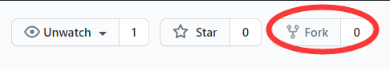
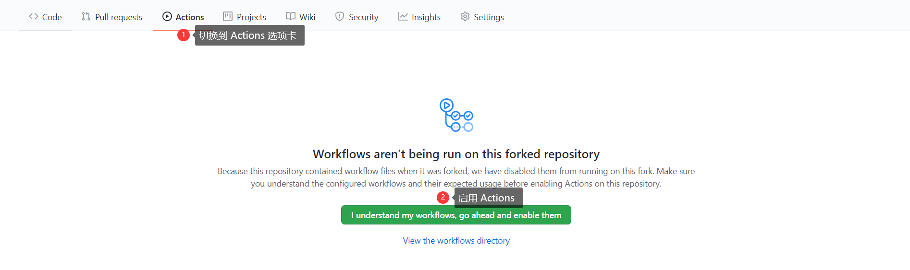

# 天翼云盘自动签到 + ~~抽奖~~
> 参考项目：https://github.com/t00t00-crypto/cloud189-action
>
>但是本项目进行了基于 app_8.9.0 的完全重构

## Github Actions 部署指南

### 一、Fork 此仓库
点击右上角的 fork 按钮即可



### 二、设置账号密码
为项目运行设置必要参数
> 设置路径: Settings-->Secrets-->New secret

Name: ACCS

Value: 如下所示

支持多账号, 每行文本为一个账号

账号与密码之间使用 ---- (四个短横线)分隔

示例：
```text
username----password
xtyuns----123456
```


### 三、启用 Action
首先切换到 Actions 选项卡

再点击 **I understand my workflows, go ahead and enable them** 按钮即可


### 四、手动触发 Actions
点击右上角的 Star 按钮即可手动触发 Actions