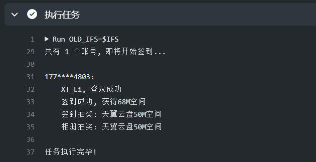

## 部署指南

### 一、Fork 此仓库
点击项目右上角的 fork 按钮即可\


### 二、设置账号密码
为项目运行设置必要参数
> 设置路径: Settings-->Secrets-->New repository secret

Name: ACCS\
Value: 如下所示
```text
username----password
xtyuns----123456
```

支持多账号, 每行文本为一个账号
账号与密码之间使用 ---- (四个短横线)分隔


### 三、启用 Actions
首先切换到 Actions 选项卡\
再点击 **I understand my workflows, go ahead and enable them** 按钮即可启用 Actions


### 四、触发 Actions
1. 当启动 Actions 之后, GitHub 会在每天 8:00 自动执行本任务
2. 你也可以通过点击右上角的 Star 按钮立即触发 Actions 事件


### 五、运行日志
在 Actions 选项卡中可以浏览所有 Actions 运行记录\
点击任意记录 ```Auto run -> run -> 执行任务```, 即可查看运行日志信息
